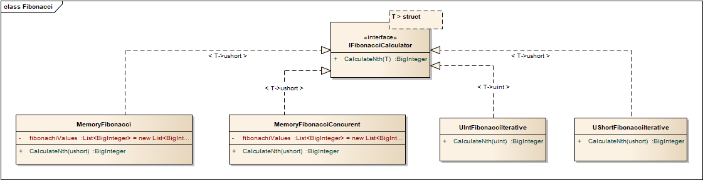
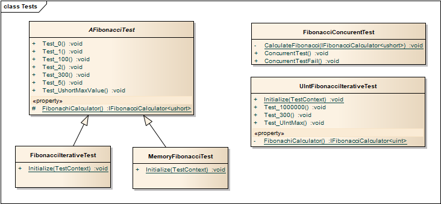

# Пресмятане на N-ият челн на редица на Фибоначи
Този проект демонстрира няколковарианта за пресмятане на n-ия член на редицата на Фибоначи. Редицата на Фибоначи е дефинирана по следния начин:
```
F(0) = 0
F(1) = 1
F(N) = F(N-1) + F(N-2), за N >= 2
```

## Начин за прсмятане
В проекта са реализирани два варианта за пресмятане на n-ия член на редицата:

* итеративен
* итеративен, запазващ намерените до момента членове в in-memory структура.

Създадени са и няколко разновидности - за N ushort и N uint.

## Тестове
Създадени са общи тестове проверяващи коректността на решенията. (Общите тестове са дефинирани в абстрактен клас, който се наследява от тестовете за конкретна реализация).

За специфичните случаи са разработени отделни тестове

## Клас диаграмr

## Диаграма на класовете имплементиращи търсенето на N-ия член



### Диаграма на тестовите класове проверяващи валидността на решенията



## По-интересни моменти

### **i++**
Кодът по-долу никога няма да приключи, защото i няма как дастане по-голямо от ```ushort.MaxValue```. Тъй като ```i++``` за максималната стойност на i си остава ```ushort.MaxValue``` и условието във for оператора никога няма да бъде удовлетворено.

```C#
BigInteger previous = 0;
BigInteger current = 1;
ushort searchedMember = ushort.MaxValue;
for (ushort i = 2; i <= searchedMember; i++)
{
    BigInteger next = previous + current;
    previous = current;
    current = next;
}
```

### Конкурентна работа

При използване на in-memory структура за запазване на пресметнатите до момента стойности и паралелно извикване на метода за пресмятане на n-ия член на редицата има голяма вероятност да се получат грешни резултати или изключения при операциите със структурата.
```C#
while (fibonachiValues.Count <= searchedMember)
{
    int i = fibonachiValues.Count;
    fibonachiValues.Add(fibonachiValues[i - 1] + fibonachiValues[i - 2]);
}
```
Проблемът в горния код (без ```lock``` върху ```fibonachiValues```) е, че е много вероятно при паралелна работа едновременното добавяне от различни нишки в общата структура. Ако това се случи индексът ```i``` ще е различен от този, който очакваме.

Варинатът позволяващ паралелно извикване от множество нишки:
```C#
lock (fibonachiValues)
{
    while (fibonachiValues.Count <= searchedMember)
    {
        int i = fibonachiValues.Count;
        fibonachiValues.Add(fibonachiValues[i - 1] + fibonachiValues[i - 2]);
    }
}
```